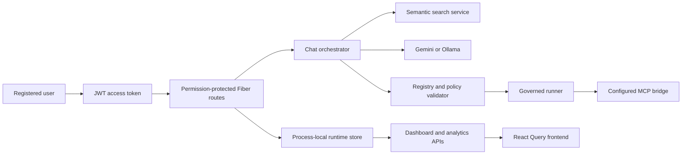

# Hard-Coded Data Cleanup and Runtime Integration Report

**Project:** Enterprise Low-Code Workflow Engine  
**Report date:** 2026-07-19  
**Implementation status:** Completed and verified  
**Scope:** Removal of fabricated runtime data, frontend/backend API integration, authentication hardening, code cleanup, and follow-up production recommendations

---

## 1. Executive Summary

The application previously presented a large amount of sample or simulated information as if it were real runtime state. This affected both the Go backend and the React frontend. Examples included seeded accounts, workflows, execution history, dashboard metrics, analytics charts, MCP status, vector database metrics, profile information, integrations, notification counts, and workflow-builder nodes.

The cleanup changed the application so that:

- business records begin empty and are created through APIs;
- authentication validates real registered accounts and bcrypt password hashes;
- refresh tokens are tracked, rotated, expired, and revoked server-side;
- backend authorization is enforced per route through permissions;
- dashboards and analytics are calculated from recorded workflows and executions;
- frontend pages load data through the backend instead of importing fixtures;
- missing external services are shown as unavailable instead of simulated as healthy;
- workflow generation failures return errors instead of silently returning invented YAML;
- workflow execution calls the governed runner and MCP boundary instead of manufacturing success;
- uploads now preserve their actual bytes and provide a working download route;
- dead fixture components and placeholder tests were removed;
- frontend search and status filters now affect real API queries;
- backend and frontend builds, lint, vet, unit tests, and integration tests pass.

The platform is now an honest development/research implementation: it reports only data it has actually recorded or retrieved. It is not yet a production-persistent system because the main runtime repository is still process-local memory.

---

## 2. Original Problems

### 2.1 Backend problems

The original backend behavior included:

- users and operational records created automatically during startup;
- authentication that could accept a fixed development token;
- login behavior that did not securely verify a stored password hash;
- fake token usage, cost, latency, recovery, dashboard, and analytics values;
- an MCP client that could report simulated execution when no MCP endpoint was configured;
- synthesis fallbacks that generated fixed workflow YAML after provider failure;
- workflow import that invented a default workflow when YAML was missing;
- upload metadata that advertised a download URL without retaining file contents;
- cancellation, invitations, OAuth, 2FA, and security features that appeared more complete than their implementation;
- routes that did not consistently enforce the permission corresponding to the operation.

### 2.2 Frontend problems

The original frontend behavior included:

- a central `mockData.js` file used as application data;
- hard-coded dashboard cards, charts, workflows, executions, users, settings, integrations, audit logs, and notifications;
- a profile fixed to a specific person, email address, role, and timezone;
- an MCP bridge screen with invented servers, tools, logs, latency, uptime, and connection status;
- vector database screens with invented document counts, storage growth, latency, sync state, and configuration;
- a workflow builder that started with sample nodes and simulated execution with timers;
- hard-coded login credentials and model choices;
- filters that were visible but did not affect loaded data;
- placeholder test suites that asserted only `true === true`;
- unused duplicate authentication and canvas components.

### 2.3 Why these problems mattered

Fabricated runtime state made it difficult to distinguish:

- a working integration from a missing integration;
- an actual workflow run from a UI animation;
- measured analytics from design-only values;
- a real authenticated principal from a fallback development identity;
- valid provider output from deterministic fallback YAML;
- persisted application state from data recreated on startup.

That ambiguity is especially risky in a governed workflow engine because the platform is intended to demonstrate RBAC, validation, auditability, policy enforcement, and safe execution.

---

## 3. Resulting Runtime Architecture



### Runtime truth rules

| Situation | Current behavior |
|---|---|
| No users exist | Registration is available; the first registered account becomes the bootstrap administrator. |
| No workflows or executions exist | Pages display an empty state and analytics return zero/empty results. |
| Wrong login password | Login returns unauthorized. |
| Expired or unknown refresh token | Refresh is rejected. |
| Missing Gemini/Ollama configuration | Synthesis returns an explicit provider/configuration error. |
| Missing semantic service | Semantic status/search returns service unavailable unless an explicitly enabled lexical fallback applies to search. |
| Missing MCP URL | Tool execution returns a configuration error and does not simulate success. |
| Invalid or incomplete workflow YAML | Creation/import/publish paths reject it before persistence or execution. |
| No healing event exists | The API returns `NO_HEALING_REQUIRED`, not a fabricated recovery. |
| No measured F1 benchmark exists | Analytics reports the metric as unavailable. |
| Cancellation requested | The API returns `501 Not Implemented` while execution remains synchronous. |
| OAuth, 2FA, password reset, invitations, or security update requested | The API reports that the feature is not configured instead of pretending it completed. |

---

## 4. Work Completed

### 4.1 Runtime data and repository cleanup

- Removed all automatically seeded business records.
- Kept only system policy definitions such as permissions and built-in roles.
- Added maps for password hashes, refresh sessions, notification preferences, and upload contents.
- Added an atomic ID counter.
- Kept the development-role override limited to role naming; it no longer creates a synthetic user.
- Made all dashboards and tables tolerate an empty store.

### 4.2 Authentication and session security

- Registration validates unique emails and hashes passwords with bcrypt.
- The first registration receives the administrator role; later registrations receive the builder role.
- Login verifies the bcrypt hash and rejects inactive users.
- Access tokens use the configured JWT secret and expiry.
- Refresh tokens are opaque values whose SHA-256 digests are stored server-side.
- Refresh rotates the token and removes the previous session.
- Logout sends the refresh token to the backend and revokes it before clearing browser storage.
- The fixed development token path was removed from normal authentication.
- `ALLOW_DEV_AUTH` now defaults to `false`.
- WebSocket query-token authentication is limited to WebSocket handshakes.
- Protected requests require the referenced user to still exist.

### 4.3 RBAC and route protection

Routes are protected using these permissions:

| Permission | Main responsibility |
|---|---|
| `workflow:read` | Workflows, executions, analytics, catalogs, dashboard, semantic status, and chat reads |
| `workflow:write` | Create/update/import/publish/archive workflows and modify chat sessions |
| `workflow:run` | Run and retry executions; cancellation route is reserved but currently unavailable |
| `settings:manage` | Settings, semantic rebuild, webhooks, integrations, and API keys |
| `user:manage` | Users, roles, and permissions |
| `audit:read` | Audit list, detail, and export |

The profile and notification routes still require authentication even where an additional named permission is not required.

### 4.4 Workflow validation, synthesis, and execution

- Workflow creation requires supplied YAML.
- Workflow names/descriptions can be derived from validated YAML when request fields are empty.
- Imported YAML must pass both structural validation and the full registry gate.
- Invalid imports are not persisted.
- Workflow ownership is assigned to the authenticated actor instead of trusting an arbitrary owner ID.
- Provider errors propagate to the caller.
- Removed deterministic fallback workflows and the fixed fallback action catalog.
- Candidate prompts use retrieved executable registry tools and explicitly prohibit invented actions.
- Ollama is supported when selected and configured.
- Unknown generation providers are rejected.
- Runner output is used for real execution state.
- Execution token/cost metrics remain zero with `measured: false` when the provider does not report usage.
- Execution lists are searchable, filterable, time-range-aware, and sorted newest first.
- Workflow success rate and last-run time are updated from recorded executions.
- Dispatch-time validation failure is recorded as a failed execution and is not incorrectly routed to healing.

### 4.5 Dashboard, analytics, live status, and semantic operations

- Summary metrics are calculated from workflows, executions, and healing reports.
- Activity is assembled from audit entries, execution events, and healing reports.
- Health describes actual provider readiness, runner presence, MCP configuration, and policy validator presence.
- Analytics endpoints calculate performance, usage, healing, latency, heatmap, and cost series from executions.
- WebSocket messages provide recurring runtime snapshots rather than a single fake event.
- Added backend proxies for semantic service health, index status, and rebuild.
- Semantic pages now show live document count, vector dimensions, provider, model, cache state, fingerprint, and service configuration.
- Historical vector charts were removed because the semantic service does not expose time-series storage/latency data.

### 4.6 Administration, integrations, profile, and uploads

- Administrator user creation requires name, email, password, and a real role ID.
- Passwords are hashed; duplicate emails are rejected.
- Self-deletion is blocked.
- Deleting a user removes their password and refresh sessions.
- Profile fields come from the authenticated user and can update name/timezone.
- Notification preferences are stored per authenticated user.
- Integration and webhook test operations perform real HTTP probes with timeouts.
- Integrations are marked connected only after a successful probe.
- Webhook URLs are validated before storage/testing.
- Upload bytes are retained in the runtime store, checksummed, retrievable, downloadable, and deleted with metadata.

### 4.7 Frontend API integration

- Added shared response unwrapping, error formatting, duration formatting, token formatting, and relative-time formatting.
- Added real services for dashboard, catalog, profile, and semantic index operations.
- Replaced mock workflow, execution, analytics, settings, users, integrations, audit, notifications, synthesis, and upload services.
- Added React Query at application level.
- Replaced effect-driven chat/session loading with React Query state.
- Added reusable loading, error, and empty states.
- Connected dashboard, workflow, template, execution, analytics, users, settings, profile, MCP, datafeed, and semantic search pages.
- Added a real authenticated WebSocket hook.
- Made the notification badge use unread notification records.
- Removed prefilled credentials and unsupported OAuth buttons from login.
- Made the workflow builder load registered tools, build YAML from the graph, detect graph cycles, save/publish workflows, and run through the backend.
- Made workflow and execution filters send real API parameters.

### 4.8 Test and dead-code cleanup

- Removed unused authentication wrappers/forms that were not used by the active auth pages.
- Removed unused canvas toolbar/config/skills components containing fixed examples.
- Removed unused settings editors that exposed static values.
- Removed the unused Zustand auth store with its fixed user.
- Removed placeholder tests with no behavioral assertions.
- Configured Jest for the current ESM, non-DOM unit tests.
- Added an `npm test` script.
- Updated integration tests to register a real user and use the issued access token.
- Updated gate tests to establish an authenticated principal without reintroducing production fallback identities.

---

## 5. Backend File-by-File Changes

### 5.1 Application startup, configuration, middleware, and routing

| File | Status | Details |
|---|---|---|
| `backend/cmd/server/main.go` | Modified | Initializes the empty runtime store, publishes effective runtime settings, loads registries, creates semantic/synthesis/runner services, and registers real MCP tools. |
| `backend/internal/config/config.go` | Modified | Development auth defaults to disabled; centralizes runtime environment configuration. |
| `backend/internal/api/middlewares/auth.go` | Modified | Removes normal fixed-token authentication and restricts query tokens to WebSocket handshakes. |
| `backend/internal/api/routes/routes.go` | Modified | Applies explicit permission middleware per route and adds semantic-index and upload-download routes. |

### 5.2 API handlers

| File | Status | Details |
|---|---|---|
| `backend/internal/api/handlers/handler.go` | Modified | Adds safe current-user lookup, required-user middleware, public user serialization, token helpers, and exported permission lookup. |
| `backend/internal/api/handlers/auth_handler.go` | Reworked | Implements bcrypt registration/login, refresh-session rotation, logout revocation, real `/me`, and honest `501` responses for unconfigured auth extensions. |
| `backend/internal/api/handlers/admin_handler.go` | Reworked | Creates real users with password hashes and role validation, blocks duplicate email/self-delete, and cleans associated authentication records. |
| `backend/internal/api/handlers/workflow_handler.go` | Reworked | Requires valid YAML, applies full-gate validation on mutation paths, assigns authenticated ownership, and persists only validated workflows. |
| `backend/internal/api/handlers/execute_handler.go` | Reworked | Runs the real governed executor, records actual status/log/timeline/healing state, removes fake usage/costs, and adds execution filtering/sorting. |
| `backend/internal/api/handlers/dashboard_handler.go` | Reworked | Derives dashboard summary, activity, recent workflows, and service health from actual state/configuration. |
| `backend/internal/api/handlers/analytics_handler.go` | Reworked | Computes all analytics responses from execution records; does not invent benchmark data. |
| `backend/internal/api/handlers/catalog_handler.go` | Modified | Serves real registry data and proxies semantic health/index status/rebuild operations. |
| `backend/internal/api/handlers/chat_handler.go` | Modified | Uses configured orchestration, rejects missing orchestration, and no longer claims a generated artifact after ignored provider errors. |
| `backend/internal/api/handlers/profile_handler.go` | Reworked | Reads/updates the authenticated profile and stores per-user notification preferences. |
| `backend/internal/api/handlers/settings_handler.go` | Reworked | Stores effective runtime settings and performs real integration/webhook probes and URL validation. |
| `backend/internal/api/handlers/notification_handler.go` | Reworked | Keeps notification operations, implements actual upload storage/download, and validates workflow imports instead of inventing YAML. |
| `backend/internal/api/handlers/websocket_handler.go` | Reworked | Streams recurring runtime snapshots from the store and configuration. |

### 5.3 Core services, models, repository, and tools

| File | Status | Details |
|---|---|---|
| `backend/internal/repository/memory.go` | Replaced | Starts empty, retains policy definitions, adds credential/session/preference/upload storage, and uses atomic IDs. |
| `backend/internal/models/user.go` | Modified | Adds user timezone support. |
| `backend/internal/core/semanticsearch/service.go` | Modified | Adds operational proxy calls for semantic health, index status, and rebuild without exposing service discovery to browser code. |
| `backend/internal/core/synthesizer/ollama_client.go` | Modified | Propagates provider failures, reports unmeasured usage honestly, and supports configured Gemini/Ollama selection. |
| `backend/internal/core/synthesizer/prompt_gen.go` | Reworked | Removes the static action catalog and deterministic fallback YAML; prompts use supplied context only. |
| `backend/internal/core/synthesizer/candidates.go` | Cleaned | Removes unused deterministic fallback candidate generation while retaining registry-grounded prompt/candidate parsing. |
| `backend/internal/tools/mcp_client.go` | Modified | Returns a configuration error when `MCP_BASE_URL` is missing instead of simulating execution. |

### 5.4 Tests directly updated by this cleanup

| File | Status | Details |
|---|---|---|
| `backend/tests/integration/api_test.go` | Modified | Registers a real test account and uses its JWT instead of a fixed development token. |
| `backend/tests/unit/synthesizer_test.go` | Modified | Expects an unavailable provider to return an error rather than fallback YAML. |
| `backend/internal/api/handlers/gate_invariant_test.go` | Adjusted | Provides an authenticated admin principal in handler tests and expects the now-synchronous execution response status. |

### 5.5 Related validation work already present in the working tree

The following files contain the active validation-token/gate-invariant implementation associated with the current branch. They were preserved and verified together with this cleanup. They should be reviewed as a separate logical commit if the branch is later split:

- `backend/internal/core/runner/executor.go`
- `backend/internal/core/runner/state_manager.go`
- `backend/internal/core/validator/registry_validator.go`
- `backend/internal/models/workflow.go`
- `backend/internal/models/validation_token.go`
- `backend/tests/unit/pipeline_test.go`
- `backend/tests/unit/runner_test.go`
- `docs/INVARIANTS.md`

---

## 6. Frontend File-by-File Changes

### 6.1 Application, configuration, and contexts

| File | Status | Details |
|---|---|---|
| `frontend/src/App.jsx` | Modified | Adds a shared React Query client/provider and uses API-backed pages. |
| `frontend/src/config/app.js` | Modified | Supports Vite runtime variables and safe test-time defaults. |
| `frontend/src/config/axios.js` | Modified | Attaches access tokens, rotates expired tokens, avoids recursive refresh on auth endpoints, and clears expired sessions. |
| `frontend/src/context/AuthContext.jsx` | Modified | Validates stored sessions, exposes real login/register/logout, and refreshes the current user after profile updates. |
| `frontend/src/context/RouteContext.jsx` | Modified | Tracks the selected workflow and provides stable navigation/open-workflow callbacks. |
| `frontend/src/context/CanvasContext.jsx` | Modified | Starts with an empty canvas instead of sample nodes. |
| `frontend/src/constants/workflowStatus.js` | Modified | Adds unvalidated-draft status metadata. |

### 6.2 Shared services

| File | Status | Details |
|---|---|---|
| `frontend/src/services/api.js` | Added | Shared API response, error, duration, relative-time, and token formatting helpers. |
| `frontend/src/services/auth.service.js` | Modified | Persists real sessions and sends the refresh token for logout revocation. |
| `frontend/src/services/dashboard.service.js` | Added | Loads summary, activity, health, and recent workflows from backend endpoints. |
| `frontend/src/services/workflow.service.js` | Reworked | Implements real workflow CRUD, YAML, canvas, template, publish, and run requests. |
| `frontend/src/services/execution.service.js` | Reworked | Implements execution list/detail/log/timeline/healing/run/retry requests. |
| `frontend/src/services/analytics.service.js` | Reworked | Loads all runtime-derived analytics endpoints. |
| `frontend/src/services/catalog.service.js` | Added | Loads the real tool catalog and groups tools for the workflow builder. |
| `frontend/src/services/profile.service.js` | Added | Loads and updates the authenticated profile. |
| `frontend/src/services/semantic.service.js` | Added | Loads semantic health/index metadata and triggers rebuild. |
| `frontend/src/services/user.service.js` | Reworked | Loads real users/roles/permission matrix/audit records and creates users. |
| `frontend/src/services/settings.service.js` | Reworked | Loads settings, integrations, webhooks, and API keys; creates webhooks. |
| `frontend/src/services/integration.service.js` | Reworked | Uses real integration list/test/connect/disconnect endpoints. |
| `frontend/src/services/audit.service.js` | Reworked | Loads real audit records. |
| `frontend/src/services/notification.service.js` | Reworked | Loads and marks real notifications. |
| `frontend/src/services/synthesis.service.js` | Reworked | Uses backend synthesis and semantic search rather than local generation fixtures. |
| `frontend/src/services/upload.service.js` | Reworked | Sends actual multipart uploads to the backend. |
| `frontend/src/services/chat.service.js` | Modified | Uses backend defaults unless an option is explicitly selected and sends real chat/session requests. |

### 6.3 Hooks and state

| File | Status | Details |
|---|---|---|
| `frontend/src/hooks/useDashboard.js` | Added | React Query dashboard loader with polling. |
| `frontend/src/hooks/useSemanticStatus.js` | Added | React Query semantic health/index loader with polling. |
| `frontend/src/hooks/useWorkflows.js` | Reworked | Loads API workflows and supports query parameters. |
| `frontend/src/hooks/useExecution.js` | Reworked | Loads execution lists plus selected execution logs/timeline/healing. |
| `frontend/src/hooks/useAnalytics.js` | Reworked | Loads runtime analytics. |
| `frontend/src/hooks/useUsers.js` | Reworked | Loads administration data. |
| `frontend/src/hooks/useSettings.js` | Reworked | Loads runtime settings. |
| `frontend/src/hooks/useLiveLog.js` | Reworked | Loads actual execution log state. |
| `frontend/src/hooks/useWebSocket.js` | Replaced | Opens an authenticated WebSocket and parses incoming runtime snapshots. |
| `frontend/src/hooks/useChat.js` | Reworked | Uses React Query/mutations for session messages and artifacts. |
| `frontend/src/hooks/useChatSessions.js` | Reworked | Uses React Query for session list/create/update/delete state. |
| `frontend/src/hooks/useWorkflowBuilder.js` | Modified | Starts with an empty workflow-builder state. |
| `frontend/src/store/canvas.store.js` | Modified | Removes sample canvas state. |
| `frontend/src/store/chat.store.js` | Modified | Removes sample chat records. |
| `frontend/src/store/workflow.store.js` | Modified | Removes sample workflow records. |

### 6.4 Pages

| File | Status | Details |
|---|---|---|
| `frontend/src/pages/dashboard/DashboardPage.jsx` | Reworked | Displays live metrics/activity/workflows/health with loading/error/empty states. |
| `frontend/src/pages/workflows/WorkflowListPage.jsx` | Reworked | Loads workflows, supports real search/status filtering, and opens selected records. |
| `frontend/src/pages/workflows/WorkflowDetailPage.jsx` | Reworked | Loads the selected workflow instead of a fixed record. |
| `frontend/src/pages/workflows/WorkflowTemplatePage.jsx` | Reworked | Loads real templates and creates workflows from them. |
| `frontend/src/pages/executions/ExecutionListPage.jsx` | Reworked | Loads execution history and supports real query/status/range filtering. |
| `frontend/src/pages/executions/ExecutionLogsPage.jsx` | Reworked | Displays actual logs, timeline, and healing evidence. |
| `frontend/src/pages/analytics/AnalyticsPage.jsx` | Reworked | Displays backend-derived analytics and unavailable states honestly. |
| `frontend/src/pages/users/UserListPage.jsx` | Reworked | Displays real users, roles, permissions, audit records, and user creation. |
| `frontend/src/pages/settings/SettingsPage.jsx` | Reworked | Displays effective settings and real integrations/webhooks/API keys. |
| `frontend/src/pages/profile/ProfilePage.jsx` | Replaced | Loads the authenticated profile and updates name/timezone. |
| `frontend/src/pages/mcp_bridge/McpBridgePage.jsx` | Replaced | Displays actual MCP configuration status and registry tools; removes fake terminal logs/latency/uptime. |
| `frontend/src/pages/datafeed/DatafeedPage.jsx` | Replaced | Displays actual semantic service/index status and triggers real rebuild. |
| `frontend/src/pages/datafeed/VectorMetricsPage.jsx` | Replaced | Displays current index counters only; removes unsupported historical graphs. |
| `frontend/src/pages/datafeed/PipelineConfigPage.jsx` | Replaced | Displays the effective read-only semantic configuration. |
| `frontend/src/pages/finetune/FinetunePage.jsx` | Replaced | Performs real semantic registry search instead of presenting simulated ERP rows. |
| `frontend/src/pages/auth/LoginPage.jsx` | Modified | Uses empty credentials and removes unsupported OAuth actions from the active login UI. |

### 6.5 Components

| Area/files | Status | Details |
|---|---|---|
| `frontend/src/components/shared/ResourceState.jsx` | Added | Reusable loading, error/retry, and empty-state UI. |
| `frontend/src/components/shared/ui/Card.jsx` | Modified | Supports semantic element selection and valid clickable cards. |
| `frontend/src/components/dashboard/ActivityFeed.jsx` | Modified | Renders supplied activity or an empty state. |
| `frontend/src/components/dashboard/RecentWorkflows.jsx` | Modified | Renders supplied workflows. |
| `frontend/src/components/dashboard/SystemHealth.jsx` | Modified | Renders actual backend health services. |
| `frontend/src/components/analytics/BarChart.jsx` | Reworked | Uses supplied performance data. |
| `frontend/src/components/analytics/LineChart.jsx` | Reworked | Uses supplied latency/time-series data. |
| `frontend/src/components/analytics/DonutChart.jsx` | Reworked | Uses supplied status distribution. |
| `frontend/src/components/analytics/HealingSuccessRate.jsx` | Reworked | Uses recorded healing metrics. |
| `frontend/src/components/analytics/HeatmapCalendar.jsx` | Reworked | Uses recorded execution activity. |
| `frontend/src/components/analytics/UsageTrendCard.jsx` | Reworked | Uses recorded token/cost data. |
| `frontend/src/components/analytics/F1ScoreGauge.jsx` | Reworked | Displays unavailable when no measured validation benchmark exists. |
| `frontend/src/components/canvas/FlowCanvas.jsx` | Modified | Receives caller-provided nodes/edges. |
| `frontend/src/components/canvas/WorkflowBuilderCanvas.jsx` | Reworked | Loads catalog tools, builds/validates YAML, detects cycles, persists/publishes/runs workflows, and removes timer simulation. |
| `frontend/src/components/chat/ChatToolbar.jsx` | Modified | Uses the environment-managed model instead of a fixed model list. |
| `frontend/src/components/chat/ChatWindow.jsx` | Modified | Reports the generic configured provider and sends real chat options. |
| `frontend/src/components/executions/ExecutionFilters.jsx` | Modified | Controlled filters now affect backend queries. |
| `frontend/src/components/executions/ExecutionTimeline.jsx` | Reworked | Uses actual recorded steps. |
| `frontend/src/components/executions/HealingReport.jsx` | Reworked | Uses actual healing evidence. |
| `frontend/src/components/executions/LiveLogStream.jsx` | Reworked | Uses actual execution logs. |
| `frontend/src/components/navigation/Topbar.jsx` | Modified | Displays the authenticated user and actual unread notification count. |
| `frontend/src/components/settings/ApiKeyCard.jsx` | Reworked | Displays API keys returned by the backend. |
| `frontend/src/components/settings/IntegrationCard.jsx` | Modified | Displays actual integration state. |
| `frontend/src/components/settings/LlmModelSelector.jsx` | Modified | Displays effective environment-managed provider/model settings. |
| `frontend/src/components/settings/WebhookForm.jsx` | Reworked | Creates a real webhook. |
| `frontend/src/components/users/UserForm.jsx` | Reworked | Creates users with password and real role selection. |
| `frontend/src/components/users/UserRow.jsx` | Modified | Displays actual user fields. |
| `frontend/src/components/users/UserTable.jsx` | Modified | Handles actual/empty user lists. |
| `frontend/src/components/users/PermissionMatrix.jsx` | Reworked | Builds columns from actual permission data. |
| `frontend/src/components/users/AuditLogTable.jsx` | Reworked | Displays actual audit entries. |
| `frontend/src/components/workflows/WorkflowFilters.jsx` | Reworked | Controlled search/status filters use valid workflow statuses. |
| `frontend/src/components/workflows/WorkflowCard.jsx` | Modified | Displays supplied workflow data and uses valid clickable markup. |
| `frontend/src/components/workflows/WorkflowTable.jsx` | Modified | Displays/open actual workflow rows. |
| `frontend/src/components/workflows/WorkflowActions.jsx` | Reworked | Runs and exports the selected workflow using backend state. |
| `frontend/src/components/workflows/TemplateCard.jsx` | Modified | Uses real template content/action state. |

### 6.6 Removed frontend files

These files were removed because they contained fixtures, duplicate inactive implementations, static editors, or placeholder tests:

```text
frontend/src/constants/mockData.js
frontend/src/store/auth.store.js
frontend/src/components/auth/AuthGuard.jsx
frontend/src/components/auth/ForgotPasswordForm.jsx
frontend/src/components/auth/LoginForm.jsx
frontend/src/components/auth/OAuthButtons.jsx
frontend/src/components/auth/RegisterForm.jsx
frontend/src/components/auth/ResetPasswordForm.jsx
frontend/src/components/auth/RoleGuard.jsx
frontend/src/components/auth/TwoFactorForm.jsx
frontend/src/components/canvas/CanvasToolbar.jsx
frontend/src/components/canvas/panels/NodeConfigPanel.jsx
frontend/src/components/canvas/panels/SkillsPanel.jsx
frontend/src/components/settings/PromptEditor.jsx
frontend/src/components/settings/RbacPolicyEditor.jsx
frontend/src/components/users/RoleSelector.jsx
frontend/src/tests/setup.js
frontend/src/tests/integration/WorkflowBuilder.test.jsx
frontend/src/tests/unit/components/ChatWindow.test.jsx
frontend/src/tests/unit/components/FlowCanvas.test.jsx
frontend/src/tests/unit/components/LoginForm.test.jsx
frontend/src/tests/unit/hooks/useAuth.test.js
```

### 6.7 Frontend test configuration

| File | Status | Details |
|---|---|---|
| `frontend/package.json` | Modified | Adds an ESM-compatible `npm test` command. |
| `frontend/jest.config.js` | Modified | Uses the Node test environment for the remaining pure unit tests. |
| `frontend/src/tests/unit/hooks/useWorkflows.test.js` | Modified | Tests API workflow normalization without fixture insertion. |

---

## 7. API Surface After Cleanup

### Public endpoints

| Method/path | Purpose |
|---|---|
| `GET /healthz` | Process health |
| `GET /api/health` | API health |
| `POST /api/auth/register` | Register an account; first account bootstraps admin |
| `POST /api/auth/login` | Password login |
| `POST /api/auth/refresh` | Rotate refresh/access tokens |
| Auth extension routes | Present but return not-configured where implementation is intentionally unavailable |

### Authenticated endpoint groups

| Group | Representative paths | Permission |
|---|---|---|
| Dashboard | `/api/dashboard/*` | `workflow:read` |
| Workflows/templates | `/api/workflows*` | Read/write/run according to action |
| Synthesis/catalog | `/api/synthesis*`, `/api/tools/catalog`, `/api/rules/catalog` | Workflow read/write |
| Semantic index | `/api/semantic-index/*` | Read; rebuild needs `settings:manage` |
| Chat | `/api/chat/sessions*` | Workflow read/write |
| Executions | `/api/executions*` | Workflow read/run |
| Analytics | `/api/analytics/*` | `workflow:read` |
| Administration | `/api/users*`, `/api/roles*`, `/api/permissions*` | `user:manage` |
| Audit | `/api/audit*` | `audit:read` |
| Profile | `/api/profile*` | Authenticated user; API keys need `settings:manage` |
| Settings/integrations/webhooks | `/api/settings*`, `/api/integrations*` | `settings:manage` |
| Notifications | `/api/notifications*` | Authenticated user |
| Uploads/import | `/api/upload*` | Workflow read/write |
| WebSocket | `/ws/{channel}?token=...` | Authenticated existing user |

---

## 8. Required Runtime Configuration

### 8.1 Backend environment variables

| Variable | Required/notes |
|---|---|
| `JWT_SECRET` | **Required for any non-local deployment.** Replace the development default with a strong secret. |
| `APP_ENV` | Use `development`, `test`, or the desired deployment environment. |
| `APP_HOST`, `APP_PORT`, `API_BASE_PATH` | Backend listener and API prefix. |
| `FRONTEND_URL` | Allowed frontend origin. |
| `JWT_EXPIRES_MINUTES` | Access-token lifetime. |
| `ALLOW_DEV_AUTH` | Defaults to `false`; keep false outside isolated experiments. |
| `DATABASE_URL` | Currently checked/configured but not used as the main application repository. See remaining work. |
| `REDIS_URL` | Currently checked/configured but not used for the main session/runtime store. |
| `WORKFLOW_GENERATION_PROVIDER` | `gemini` or `ollama`. |
| `GEMINI_API_KEY`, `GEMINI_MODEL` | Required when generation provider is Gemini. |
| `OLLAMA_ENABLED`, `OLLAMA_BASE_URL`, `OLLAMA_MODEL` | Required when generation provider is Ollama. |
| `MCP_BASE_URL`, `MCP_TIMEOUT_SECONDS` | Required for actual external tool execution. |
| `DATASET_ROOT` | Dataset root when registry JSON files are not used directly. |
| `TOOL_REGISTRY_PATH`, `RULE_REGISTRY_PATH` | Registry JSON paths. |
| `SEMANTIC_SEARCH_MODE` | Normally `external_embedding`. |
| `SEMANTIC_SEARCH_URL` | Normally `http://localhost:8090/search`. |
| `SEMANTIC_SEARCH_TOP_K_*` | Retrieval limits for tools/rules/templates/examples. |
| `SEMANTIC_SEARCH_ALLOW_LEXICAL_FALLBACK` | Keep false when external embedding retrieval is mandatory. |
| `CANDIDATE_COUNT` | Number of generation candidates, capped by backend logic. |
| `CHAT_TRACE_BOXES` | Terminal tracing for development. |
| `CHAT_USER_ROLE_OVERRIDE` | Research simulation override; avoid in normal multi-user runtime. |

### 8.2 Frontend environment variables

| Variable | Default |
|---|---|
| `VITE_APP_NAME` | `Agentic Workflow Engine` |
| `VITE_API_BASE_URL` | `http://localhost:8080/api` |
| `VITE_WS_BASE_URL` | `ws://localhost:8080/ws` |
| `VITE_ANALYTICS_ENABLED` | Disabled unless set to `true` |

### 8.3 Minimal development startup

Backend:

```powershell
cd backend
$env:JWT_SECRET="replace-this-development-secret"
$env:WORKFLOW_GENERATION_PROVIDER="gemini"
$env:GEMINI_API_KEY="[REDACTED]"
$env:MCP_BASE_URL="http://your-mcp-service"
go run ./cmd/server
```

Frontend:

```powershell
cd frontend
npm install
npm run dev
```

Then register the first account through the registration screen. That account becomes the bootstrap platform administrator.

### 8.4 Semantic service startup

```powershell
cd backend/semantic_search_service
python -m venv .venv
.\.venv\Scripts\Activate.ps1
pip install -r requirements.txt
$env:DATASET_ROOT="..\dataset"
$env:EMBEDDING_PROVIDER="ollama"
$env:OLLAMA_EMBEDDING_BASE_URL="http://localhost:11434"
$env:OLLAMA_EMBEDDING_MODEL="nomic-embed-text"
uvicorn app:app --host 127.0.0.1 --port 8090
```

The Go backend should use:

```powershell
$env:SEMANTIC_SEARCH_MODE="external_embedding"
$env:SEMANTIC_SEARCH_URL="http://localhost:8090/search"
```

---

## 9. Verification Evidence

The following checks passed after the implementation:

| Check | Result |
|---|---|
| `go build -buildvcs=false ./...` | Passed |
| `go vet ./...` | Passed |
| `go test ./...` | Passed across handlers, orchestrator, integration, and unit packages |
| Full Go suite duration | Approximately 90 seconds; generated semantic/validator datasets account for most of the time |
| `npm run lint` | Passed with no ESLint errors or warnings |
| `npm test` | Passed: 3 suites, 3 tests |
| `npm run build` | Passed: Vite production build completed |
| Production bundle note | Main JavaScript chunk is approximately 628 KB before gzip and triggers Vite's non-blocking chunk-size warning |
| `git diff --check` | No whitespace errors; only expected Windows line-ending notices were emitted |

The integration authentication test now obtains a real token by registering an account. Production authentication was not weakened to make tests pass.

---

## 10. Known Limitations and Remaining Work

### Priority 0: required before production use

#### 10.1 Add durable persistence

The application still uses `repository.Store`, which is process-local memory. Restarting the backend removes:

- users and password hashes;
- refresh sessions;
- workflows and versions;
- executions, logs, timelines, and healing reports;
- chat sessions;
- integrations, webhooks, API keys, notifications, and uploads.

`DATABASE_URL` and `REDIS_URL` are loaded, but their clients are not used as the authoritative repository. The next major task should be:

1. define repository interfaces;
2. create PostgreSQL migrations;
3. implement transactional PostgreSQL repositories;
4. move refresh sessions/cache/pub-sub to Redis where appropriate;
5. migrate uploads to object storage or a controlled filesystem;
6. add startup migration and backup/restore procedures.

#### 10.2 Add record ownership and tenant isolation

Several in-memory record types do not yet carry a user/tenant owner. Authenticated users with the same route permission may currently observe shared records such as chat sessions or notifications. Add:

- `tenant_id` and/or `user_id` to relevant models;
- scoped repository queries;
- object-level authorization checks;
- tests proving one user cannot read or mutate another user's records.

#### 10.3 Complete secrets and external authentication features

Implement or deliberately remove the routes for:

- password reset and email delivery;
- email verification;
- OAuth provider authorization/callback;
- 2FA enrollment/verification/recovery;
- user invitations;
- profile security/password changes.

Until implemented, the current explicit `501 Not Implemented` behavior should remain.

#### 10.4 Harden outbound integration requests

Webhook/integration probes validate scheme and host, but production code should also prevent SSRF by blocking:

- loopback and link-local addresses;
- private network ranges unless explicitly allowlisted;
- cloud metadata IP addresses;
- DNS rebinding;
- redirects to prohibited destinations.

Add hostname allowlists, resolved-IP checks, redirect policies, body-size limits, and audit logging.

#### 10.5 Harden API key storage and usage

API keys need a production design:

- store only a digest after initial display;
- associate the key with a user/tenant;
- validate key scopes in authentication middleware;
- add expiry, last-used time, rotation, and revocation audit;
- never retain the full key value in normal list responses.

### Priority 1: correctness and operations

#### 10.6 Add asynchronous execution and real cancellation

Execution is synchronous, so cancellation returns `501`. Introduce:

- a durable job queue;
- worker processes;
- cancellable contexts and persisted job state;
- idempotency enforcement;
- retries with backoff and maximum attempt policy;
- real-time event delivery instead of polling-only snapshots.

#### 10.7 Capture measured provider usage

Token counts and costs are intentionally zero when not reported. Add provider response parsing and a pricing configuration table. Mark every metric with provider/model/currency/timestamp and distinguish estimated from billed cost.

#### 10.8 Improve WebSocket behavior

The frontend hook should add:

- reconnect with exponential backoff;
- access-token refresh/reconnect;
- heartbeat/timeout handling;
- channel-specific message typing;
- cleanup and visibility-aware reconnect behavior.

#### 10.9 Align frontend navigation with permissions

Backend authorization is enforced, but the sidebar should also hide or disable administration/settings pages the user cannot access. The backend must remain authoritative even after this UI improvement.

#### 10.10 Improve pagination and query consistency

Some pages load only the default first page. Add:

- pagination controls;
- stable sorting for every list;
- server-supported query/range filters for audit, users, notifications, and workflows;
- total-count handling in React Query;
- URL or route persistence for filters.

### Priority 2: maintainability, quality, and performance

#### 10.11 Expand frontend tests

Only three useful pure unit tests currently remain. Add:

- React component tests with an installed `jest-environment-jsdom` or migrate to Vitest;
- Mock Service Worker API tests;
- workflow-builder graph/YAML tests;
- authentication refresh/logout tests;
- empty/loading/error-state tests;
- Playwright end-to-end tests covering registration, workflow creation, validation, and execution failure.

#### 10.12 Split the frontend production bundle

The build succeeds but the main chunk exceeds Vite's 500 KB warning threshold. Use route/page-level `React.lazy`, dynamic chart/canvas imports, and manual vendor chunks for React Flow, Recharts, and Iconify.

#### 10.13 Improve date, locale, and accessibility behavior

- Use a shared locale/timezone formatter.
- Validate timezone values against IANA zones.
- Add keyboard and screen-reader testing for the builder and data tables.
- Add focus management for async errors, dialogs, and page navigation.

#### 10.14 Add operational observability

- structured request/correlation IDs;
- Prometheus metrics;
- tracing across backend, semantic service, provider, and MCP calls;
- readiness/liveness distinction;
- alerting for provider/MCP/semantic failures;
- audit retention and export policies.

---

## 11. Recommended Implementation Order

| Order | Task | Outcome |
|---:|---|---|
| 1 | PostgreSQL repository and migrations | Records survive restart and can be queried safely |
| 2 | User/tenant ownership enforcement | Data isolation between principals |
| 3 | API key hashing and scope authentication | Safe programmatic access |
| 4 | SSRF-hardened integration/webhook client | Safer outbound connections |
| 5 | Async execution queue and cancellation | Correct long-running workflow operation |
| 6 | Password reset/email/OAuth/2FA | Complete account lifecycle |
| 7 | Provider usage and cost measurement | Trustworthy financial analytics |
| 8 | Frontend permission-aware navigation/pagination | Better UX aligned with backend authorization |
| 9 | End-to-end and browser test suite | Regression protection for the real user journey |
| 10 | Frontend code splitting and observability | Better load time and production operations |

---

## 12. Acceptance Checklist

### Completed

- [x] No seeded business records in the backend runtime store.
- [x] No central frontend mock-data import.
- [x] No fixed profile identity or prefilled login credentials.
- [x] Passwords are bcrypt-hashed and validated.
- [x] Refresh tokens are stored as digests, rotated, and revoked.
- [x] Fixed development token is not accepted by normal auth.
- [x] Permission middleware protects route groups.
- [x] Dashboard and analytics derive from recorded data.
- [x] MCP absence returns an error rather than simulated success.
- [x] Provider failure does not return invented fallback YAML.
- [x] Workflow import requires and validates supplied YAML.
- [x] Upload/download stores actual file contents during the process lifetime.
- [x] Frontend pages use real APIs and display loading/error/empty states.
- [x] Workflow builder uses the real tool catalog and backend persistence/run paths.
- [x] Workflow and execution filters affect backend queries.
- [x] Backend build, vet, unit, integration, and full tests pass.
- [x] Frontend lint, tests, and production build pass.

### Still required for production

- [ ] Durable database-backed repositories and migrations.
- [ ] Tenant/user ownership on all records.
- [ ] Secure object/file storage.
- [ ] API key digest authentication and lifecycle.
- [ ] SSRF-hardened outbound requests.
- [ ] Async jobs and cancellation.
- [ ] Password reset, email verification, OAuth, 2FA, and invitations.
- [ ] Measured provider usage/cost.
- [ ] Permission-aware frontend navigation.
- [ ] Comprehensive frontend integration/E2E tests.
- [ ] Production monitoring, tracing, backups, and deployment runbooks.

---

## 13. Rules for Future Changes

To preserve the cleanup, future contributors should follow these rules:

1. Do not put sample business records in runtime repositories or default frontend state.
2. Put demo data in explicit fixtures, Storybook stories, test factories, or a separate opt-in seeding command.
3. Never report a provider, integration, MCP server, database, or vector index as healthy without checking real state.
4. Never convert an external-service error into invented success data.
5. Mark estimates as estimates and unavailable metrics as unavailable.
6. Keep backend authorization authoritative; frontend visibility is only a usability layer.
7. Require structural and full registry validation before persisting or executing workflow YAML.
8. Never store plaintext passwords, refresh tokens, or production API keys.
9. Add a failing test before fixing any regression involving validation, authorization, or execution safety.
10. Keep system policy defaults clearly separate from business/demo records.

---

## 14. Final Status

The hard-coded runtime-data cleanup is complete. The application now uses real backend state and clearly exposes unavailable integrations instead of simulating them. The codebase compiles, passes current tests, and provides a substantially more trustworthy foundation for the intended governed low-code workflow engine.

The next decisive milestone is durable, tenant-aware persistence. Until that is implemented, the system should be described as a verified development/research runtime rather than a production deployment.
