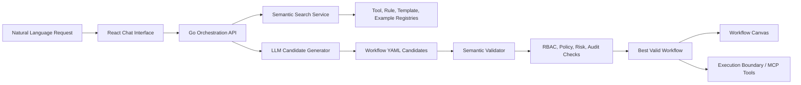

# Research Low-Code Workflow Engine

[](backend)
[](frontend)
[](backend/semantic_search_service)
[](docs/ROLE_NATURAL_LANGUAGE_TEST_GUIDE.md)
[](frontend/src/components/canvas)

## Project Overview

The **Enterprise Low-Code Workflow Engine** is a research-driven workflow automation platform that converts natural-language business requests into governed, validated, and visually inspectable enterprise workflows.

The project focuses on a critical question in modern enterprise automation:

> How can an AI-assisted low-code system generate useful workflows while still respecting business rules, role-based access control, audit requirements, process order, and tool safety?

Instead of allowing a language model to directly produce unrestricted automation logic, this system places the model inside a controlled orchestration pipeline. User intent is first grounded through dataset-backed semantic retrieval, then converted into multiple workflow candidates, validated against enterprise governance rules, and only then exposed as executable workflow YAML and canvas flow.

## Problem Statement

Traditional low-code tools reduce manual development effort, but they still require users to understand workflow syntax, tool capabilities, integrations, and policy constraints. On the other side, pure AI workflow generation can produce unsafe, incomplete, or hallucinated automations.

This project addresses the gap between those two approaches by combining:

- natural-language workflow creation,
- semantic retrieval over enterprise tool and rule registries,
- LLM-based candidate generation,
- deterministic semantic validation,
- RBAC-aware plan validation,
- registry-based audit checks and gate decision records,
- and visual workflow canvas representation.

The result is a research prototype for measuring governed AI-assisted workflow generation in enterprise-style ERP scenarios.

## Research Objectives

The main objectives of this implementation are:

1. Convert business-level natural-language requests into structured workflow definitions.
2. Retrieve relevant tools, governance rules, templates, and examples before generation.
3. Prevent hallucinated or unauthorized workflow actions.
4. Validate generated workflows using role, policy, risk, process-order, and audit controls.
5. Select the best valid workflow candidate from multiple generated outputs.
6. Display validated workflows visually in a canvas-based low-code interface.
7. Demonstrate safety behavior for critical actions such as deleting admins, users, employees, roles, or permissions.

## Key Contributions

| Contribution | Description |
|---|---|
| Retrieval-grounded workflow generation | Uses semantic search to retrieve relevant tools, rules, process templates, and examples before prompting the LLM. |
| Multi-candidate workflow synthesis | Generates multiple YAML workflow candidates and validates each candidate independently. |
| Semantic governance validator | Checks tool validity, required parameters, RBAC, policy thresholds, process order, audit requirements, and risk controls. |
| Critical intent blocking | Blocks destructive identity/admin requests before workflow generation begins. |
| Role-aware simulation | Allows testing workflow behavior under dataset roles such as `procurement_officer`, `finance_editor`, `hr_manager`, and `employee`. |
| Canvas integration | Converts validated workflow YAML into a visual React Flow canvas for low-code inspection. |
| Enterprise UI surface | Provides dashboards, chat-based generation, workflow management, executions, analytics, settings, users, roles, audit, and profile sections. |

## What The System Does

The system supports an end-to-end workflow generation lifecycle:

1. A user enters a natural-language request such as:

   > Create a purchase order for 150 laptops from vendor V-882 and send it for approval.

2. The backend retrieves relevant tools and governance rules from the dataset.

3. The LLM generates multiple YAML workflow candidates using only registered tools.

4. The semantic validator checks each candidate.

5. A valid candidate is selected only if all governance checks pass.

6. The frontend displays the selected workflow and allows it to be passed to the canvas.

7. The canvas renders the validated workflow visually for review.

For the purchase order example, a valid governed workflow is expected to follow this order:

```text
Validate Vendor
  -> Check Procurement Policy Limit
  -> Request Human Approval
  -> Create Purchase Order
  -> Write Audit Log
```

## System Architecture



## Major Components

### Frontend Application

The frontend is a React-based enterprise interface for workflow creation, monitoring, and administration.

Important areas:

- [Chat workflow generation](frontend/src/components/chat)
- [Workflow canvas](frontend/src/components/canvas)
- [Workflow pages](frontend/src/pages/workflows)
- [Execution monitoring](frontend/src/pages/executions)
- [Analytics dashboards](frontend/src/pages/analytics)
- [Users, roles, and audit views](frontend/src/pages/users)
- [Settings and integrations](frontend/src/pages/settings)

### Backend Orchestration API

The Go backend coordinates these workflow pipeline components:

- chat request handling,
- semantic retrieval,
- candidate generation,
- YAML parsing,
- semantic validation,
- candidate selection,
- workflow persistence model,
- execution orchestration,
- audit and RBAC behavior.

Backend entry point:

- [backend/cmd/server](backend/cmd/server)

Core backend modules:

- [orchestrator](backend/internal/core/orchestrator)
- [synthesizer](backend/internal/core/synthesizer)
- [validator](backend/internal/core/validator)
- [semantic search client](backend/internal/core/semanticsearch)
- [runner](backend/internal/core/runner)
- [tool registry](backend/internal/tools)

### Semantic Search Service

The semantic search service retrieves relevant project knowledge before workflow generation. It uses local embeddings and FAISS indexing over the project dataset.

It retrieves:

- executable tool definitions,
- governance rules,
- process templates,
- few-shot workflow examples,
- validation scenarios.

Service documentation:

- [backend/semantic_search_service](backend/semantic_search_service)

### Governance Registry

The running application uses mutable registries for tool and rule governance:

- `backend/configs/runtime/all_tools_master_registry.json`
- `backend/configs/runtime/all_rules_master_registry.json`

They are created on first boot according to `RUNTIME_REGISTRY_SEED` (`copy` by
default, or `empty`) and are never overwritten once present. The corresponding
files below are frozen research-evaluation inputs, not application storage:

- [Tool registry](backend/configs/registries/all_tools_master_registry.json)
- [Rule registry](backend/configs/registries/all_rules_master_registry.json)

These registries allow the system to determine:

- which tools exist,
- which tools are executable,
- which roles may use them,
- which parameters are required,
- which actions are high risk,
- which workflows require approval,
- which workflows require audit logging,
- and which process order must be followed.

## Governance And Safety Model

A central part of this project is the separation between **generation** and **validation**.

The LLM is responsible for proposing workflow candidates. The backend validator is responsible for deciding whether those candidates are valid.

The validator checks:

| Validation Area | Purpose |
|---|---|
| Tool validity | Prevents hallucinated or unregistered workflow actions. |
| Parameter completeness | Ensures required tool inputs are present. |
| RBAC | Ensures the current role is allowed to use selected tools. |
| Policy rules | Enforces domain-specific business controls. |
| Process order | Ensures required pre-checks happen before write actions. |
| Risk escalation | Checks for an approval-named step at plan time; it does not implement an approval lifecycle. |
| Auditability | Applies registry audit rules and records gate decisions; complete tamper-resistant provenance is not enforced. |
| Sensitive data safety | Prevents secrets from appearing in generated workflow YAML. |

## Critical Action Blocking

The platform explicitly blocks destructive identity and administrator actions before workflow generation.

Examples of blocked requests:

```text
delete the admin
remove employee
disable user account
revoke admin access
remove all roles and permissions
```

These requests should return no workflow candidates and no selected workflow YAML. This behavior is important because privileged identity operations should not be generated casually through natural language.

The focused safety test is implemented in:

- [chat_safety_test.go](backend/internal/core/orchestrator/chat_safety_test.go)

## Role-Based Behavior

The system supports testing with different enterprise roles from the dataset and registry rules.

Example roles:

```text
procurement_officer
procurement_manager
finance_editor
finance_manager
finance_viewer
hr_manager
hr_viewer
employee
inv_editor
Auditor
Execution Reviewer
Workflow Builder
```

This enables realistic validation of whether a workflow should be allowed, blocked, escalated for approval, or rejected due to insufficient permission.

The full role-based prompt matrix is available here:

- [Role Natural Language Test Guide](docs/ROLE_NATURAL_LANGUAGE_TEST_GUIDE.md)

## Example Use Case: Procurement Workflow

User request:

```text
Create a purchase order for 150 laptops from vendor V-882 and send it for approval.
```

The system retrieves procurement tools and rules, then validates that the generated workflow includes:

1. vendor validation,
2. procurement policy limit check,
3. human approval because quantity is above threshold,
4. purchase order creation,
5. audit logging.

This demonstrates how the platform combines natural language, semantic retrieval, policy compliance, and workflow visualization.

## Evaluation Strategy

The project is evaluated through:

- backend unit tests,
- integration tests,
- role-based prompt testing,
- critical request safety tests,
- workflow validation scenarios,
- generated candidate scoring,
- API response inspection,
- frontend canvas verification.

Important test and validation references:

- [Backend tests](backend/tests)
- [Role prompt guide](docs/ROLE_NATURAL_LANGUAGE_TEST_GUIDE.md)
- [API documentation](docs/api)
- [Semantic pipeline documentation](backend/docs/CHAT_EMBEDDING_SEARCH_GEMINI_PIPELINE.md)

## Technical Stack

| Layer | Technology |
|---|---|
| Frontend | React, Vite, Tailwind CSS, React Flow, TanStack Query, Zustand |
| Backend | Go, Fiber, Zap logging, JWT-based local auth |
| Semantic Retrieval | Python, FastAPI/Uvicorn, FAISS, Ollama embeddings |
| Workflow Generation | Configurable Gemini, Ollama, or OpenAI-compatible provider |
| Validation | Registry-based semantic validator with RBAC and policy checks |
| Visualization | React Flow canvas |
| Execution Boundary | MCP-style tool registry and mock ERP bridge |

## Documentation Index

| Document | Description |
|---|---|
| [Backend README](backend/README.md) | Backend setup, architecture, and API overview. |
| [Semantic Search Service](backend/semantic_search_service/README.md) | Embedding search service and FAISS index documentation. |
| [API Documentation](docs/api/README.md) | API endpoint documentation. |
| [Role Natural Language Test Guide](docs/ROLE_NATURAL_LANGUAGE_TEST_GUIDE.md) | Role-by-role good and bad natural-language prompt matrix. |
| [Chat Semantic Pipeline](backend/docs/CHAT_EMBEDDING_SEARCH_GEMINI_PIPELINE.md) | Detailed explanation of retrieval, generation, validation, and selection. |
| [Backend Codebase Index](backend/docs/CODEBASE_INDEX.md) | Generated codebase navigation reference. |
| [Consolidated Results](docs/RESULTS.md) | Frozen experiment setup, confusion matrices, registry hashes, and disclosures. |
| [Validation and Dispatch Invariants](docs/INVARIANTS.md) | Test-backed G1–G5 and structural model-independence boundaries. |

## Verified Safety Boundaries

| Boundary | Status | Proving tests |
|---|---|---|
| Production dispatch requires a validator-minted capability | ENFORCED | `TestRunnerRejectsMissingOrMismatchedValidationTokenWithoutExecution`, `TestMCPClientZeroValueCapabilityMakesNoHTTPRequest`, `TestMCPClientMutatedParametersFailHashWithoutHTTPRequest` |
| Resolved threshold, required-parameter, and sensitive-key checks | PARTIAL | `TestDeferredThresholdDispatch`, `TestDeferredRequiredParameterRevalidatedAtDispatch`, `TestResolvedSensitiveKeyAbortsBeforeTool` |
| Experiment gate-off cannot use a real MCP-backed tool | ENFORCED in the experiment build | `TestExperimentGateOffRejectsRealMCPToolRegistry` |
| Side-effect idempotency (G3) | NOT ENFORCED | No proving test exists |
| Recorded human approval lifecycle (G4) | NOT ENFORCED | No proving test exists |
| Complete tamper-resistant provenance (G5) | NOT ENFORCED | No proving test exists |
| Model independence of gate decisions | STRUCTURAL GUARANTEE | `TestGateVerdictsAreDeterministicAcrossRepeatedRuns`, `TestGateVerdictIsInvariantToModelProvenance`, `TestValidatorImportsNoModelOrSynthesisPackage` |

Baseline B is retained for gate-on/gate-off research. It is compiled only with `-tags experiment`, is absent from the production binary, and gate-off accepts only marked spy/no-op tools. Evidence: `TestBaselineBExecutesDispatchViolationAndAuditsBypass`, `TestExperimentGateOffRejectsRealMCPToolRegistry`, and `TestExperimentHarnessProducesCSVAndMetricsForFourCases`.

See [docs/INVARIANTS.md](docs/INVARIANTS.md) for the precise G1–G5 status.

## Project Scope

This project is currently implemented as a research and demonstration platform. It defaults to local development infrastructure and an in-memory backend repository; an encrypted PostgreSQL snapshot store is optional, but production deployment hardening is not established.

The implementation is intended for:

- academic viva demonstration,
- research evaluation,
- prototype validation,
- enterprise workflow automation concept demonstration,
- governance-aware AI workflow generation experiments.

## Current Limitations

The current version intentionally keeps these concerns out of scope or unenforced:

- enterprise SSO is not implemented,
- ERP execution uses a mock/MCP-style tool boundary,
- semantic search uses a local FAISS index,
- Singlish/Sinhala normalization is identified as a future improvement,
- side-effect idempotency (G3) is not enforced,
- a recorded approval lifecycle (G4) is not enforced,
- complete tamper-resistant provenance (G5) is not enforced,
- the Smart Dispatcher specified in `CLAUDE.md` is not implemented; existing hard-coded orchestration branches are not that component,
- the multi-model generation-quality study is specified but not run,
- deployment secret management and operational hardening remain environment-specific work.

## Future Enhancements

Recommended future work:

1. Enforce G3 idempotency by carrying a stable key through retries and external dispatch, with ambiguity and deduplication tests.
2. Implement G4 runtime approval with a durable approval record, execution suspension/resumption, and distinct-principal enforcement.
3. Complete G5 with append-only, tamper-resistant model, prompt, policy, registry, and decision provenance.
4. Implement the Smart Dispatcher specified in `CLAUDE.md`; it is not present in the current codebase.
5. Run the independently labelled multi-model generation-quality study described below.
6. Add enterprise SSO/OIDC authentication and production deployment hardening.
7. Improve multilingual/Singlish normalization, ERP integration coverage, and governance explainability.
8. Replace local FAISS with a managed retrieval service if production scale requires it.

The multi-model study was not run because the dataset labels the workflow artifact, not the instruction. A model receiving an unsafe instruction that emits a safe workflow would be scored as a gate false negative, conflating model refusal behaviour with gate recall. Sound execution requires independent labelling of every generated artifact. The study measures generation quality, not enforcement; enforcement invariance is established structurally.

## Summary

The **Research Low-Code Workflow Engine** demonstrates an AI-assisted workflow architecture in which generated plans pass through deterministic validation and a capability-bound dispatch boundary. The enforced and unenforced portions of that architecture are listed above and in `docs/INVARIANTS.md`.

