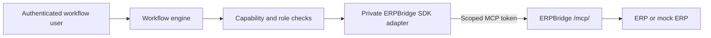

# ERPBridge MCP integration

This guide explains how to configure, deploy, and check the ERPBridge MCP transport for the TypeScript workflow engine.

## What this integration does

The workflow engine connects to the ERPBridge Streamable HTTP MCP endpoint at `/mcp/`.

The engine does not call the admin-only `/api/tools/invoke` endpoint.

The engine receives only a scoped MCP service token. It never receives the ERPBridge administrator credential.

The private adapter uses `@erpbridge/sdk@1.1.0` and sets `mcpRetryPolicy: "never"`. A transport failure never causes a second tool call.

The engine checks the dispatch capability before it calls the SDK. The capability binds the action, business parameters, expiry, single-use state, authenticated user, local role, and mapped ERPBridge role.

## Data flow



ERPBridge authenticates the service account. The workflow engine records the human user and execution identity.

## Prerequisites

Before you configure the engine, prepare these items:

- An ERPBridge server with the MCP endpoint enabled.
- A scoped bearer token with the `mcp` scope.
- One or more approved ERPBridge roles for the token.
- A local role map that uses the same approved roles.
- A reviewed local tool registry that matches the tools that the workflow can use.
- HTTPS for every non-development ERPBridge endpoint.

Do not use an ERPBridge administrator token in the workflow engine.

## Configuration

Set `MCP_TRANSPORT=erpbridge-mcp` to select the ERPBridge adapter. The default transport is `bridge-v1`.

| Variable | Required | Description |
| --- | --- | --- |
| `MCP_TRANSPORT` | Yes | Use `erpbridge-mcp`. The default is `bridge-v1`. |
| `ERPBRIDGE_BASE_URL` | Yes | Base URL of the ERPBridge server. Use HTTPS outside development. |
| `ERPBRIDGE_MCP_TOKEN` | One source | Scoped bearer token with the `mcp` scope. |
| `ERPBRIDGE_MCP_TOKEN_ENV` | One source | Name of the environment variable that stores the token. |
| `ERPBRIDGE_ROLE_MAP` | Yes | Strict JSON map from local roles to ERPBridge roles. |

Set exactly one token source. The engine rejects both token variables when they are set.

Do not put a token in a workflow, YAML file, registry value, log, diagnostic, or public API response.

### Example with a direct token value

Use this form only for local development. Use a secret manager in a deployed environment.

```bash
export MCP_TRANSPORT=erpbridge-mcp
export ERPBRIDGE_BASE_URL=https://erpbridge.example
export ERPBRIDGE_MCP_TOKEN='[REDACTED]'
export ERPBRIDGE_ROLE_MAP='{"Workflow Builder":"workflow_builder","Client":"client"}'
npm run dev
```

### Example with a secret-manager environment variable

Set the token value in the secret manager. Inject the selected environment variable into the engine process.

```bash
export MCP_TRANSPORT=erpbridge-mcp
export ERPBRIDGE_BASE_URL=https://erpbridge.example
export ERPBRIDGE_MCP_TOKEN_ENV=WORKFLOW_ERPBRIDGE_TOKEN
export ERPBRIDGE_ROLE_MAP='{"Workflow Builder":"workflow_builder","Client":"client"}'
npm run dev
```

The engine accepts these built-in local roles in the role map:

- `Platform Admin`
- `System Admin`
- `Workflow Builder`
- `Client`

The engine rejects unknown local roles, blank remote roles, and duplicate remote roles.

## Role mapping

The local role comes from the authenticated workflow user.

The mapped ERPBridge role is added only for a guarded tool.

A workflow cannot provide, replace, or override the ERPBridge role.

| Local workflow role | ERPBridge role | Tool `allowedRoles` |
| --- | --- | --- |
| `Platform Admin` | `platform_admin` | `platform_admin` |
| `System Admin` | `system_admin` | `system_admin` |
| `Workflow Builder` | `workflow_builder` | `workflow_builder` |
| `Client` | `client` | `client` |

Use only the rows required by the deployment. A test token can contain only `workflow_builder` and `client`.

The local registry remains the source of truth for these tool values:

- Local action name.
- Remote MCP tool name.
- Input schema.
- Required and optional parameters.
- Risk level.
- Side effects.
- Local role access.

## Token provisioning and rotation

Use an ERPBridge administrator credential only to create, list, or revoke tokens.

Do not send that credential to the workflow engine.

Create a named token with the smallest scope, the smallest role set, and a fixed expiry.

```bash
export BRIDGE_API_TOKEN='[REDACTED]'
bridgectl --context local token create \
  --name lcwe-production-mcp \
  --scope mcp \
  --role workflow_builder \
  --role client \
  --expires 720h
unset BRIDGE_API_TOKEN
```

Store the returned `erpbt_` value in the deployment secret manager as `ERPBRIDGE_MCP_TOKEN`.

Record only the token name, scope, roles, token ID, and expiry. Do not record the token value in source control, tickets, or logs.

Rotate the token before it expires:

1. Create a replacement token.
2. Store the replacement value in the secret manager.
3. Restart or reload the workflow engine.
4. Run the deployment checks.
5. Revoke the old token.

```bash
export BRIDGE_API_TOKEN='[REDACTED]'
bridgectl --context local token revoke '<token-id>'
unset BRIDGE_API_TOKEN
```

## Registry authority and discovery

The workflow engine does not auto-import remote tools.

The local registry is reviewed and authoritative. Remote `tools/list` discovery is a compatibility check only.

Run the compatibility check after you configure the token:

```bash
MCP_TRANSPORT=erpbridge-mcp \
ERPBRIDGE_BASE_URL=https://erpbridge.example \
ERPBRIDGE_MCP_TOKEN_ENV=WORKFLOW_ERPBRIDGE_TOKEN \
ERPBRIDGE_ROLE_MAP='{"Workflow Builder":"workflow_builder","Client":"client"}' \
npm run verify:erpbridge-registry
```

The command reports these conditions:

- `missing`: a reviewed local tool is not present on ERPBridge.
- `incompatible`: the remote input schema differs from the local schema.
- `unreviewed`: ERPBridge exposes a tool that the local registry does not review.
- `duplicateRemoteNames`: ERPBridge returns duplicate tool names.

The command exits with a failure when any condition is present. It never changes the local registry.

### Web view

Open `/mcp-bridge` in the frontend to view the local MCP Bridge status and the reviewed local tool registry.

The page displays the configured endpoint and local tool count. It does not display every remote tool from `tools/list`.

Use `npm run verify:erpbridge-registry` to inspect remote discovery and registry drift.

## Deployment checks

Run these checks against a non-production ERPBridge server before deployment:

1. Make sure that an allowed read-only MCP tool call succeeds.
2. Make sure that a token without the `mcp` scope receives HTTP 403.
3. Make sure that a revoked token receives HTTP 401.
4. Make sure that a role absent from the token fails at ERPBridge.
5. Make sure that a role absent from the tool allow-list fails at ERPBridge.
6. Make sure that an ambiguous transport failure produces one tool-call attempt.
7. Make sure that registry drift fails the compatibility check and does not change the local registry.

A successful call while ERPBridge authentication is disabled does not prove token enforcement. Enable temporary authentication for the 401 and 403 checks, then revoke all test tokens and restore the original configuration.

## Browser smoke test

Use the frontend to check the complete path:

1. Start the TypeScript backend with `MCP_TRANSPORT=erpbridge-mcp`.
2. Start the frontend.
3. Sign in with a user that has workflow permissions.
4. Open **MCP Bridge** and then **Bridge Overview**.
5. Make sure that the page shows `Configured` and `healthy`.
6. Make sure that the local reviewed tool appears in the tool table.
7. Create a workflow that uses one reviewed read-only tool.
8. Run the workflow.
9. Make sure that the execution status is `Done`.
10. Make sure that the execution timeline contains the expected tool action.

The browser smoke test proves the workflow-engine adapter path. Run the registry compatibility command separately to prove remote discovery.

## Failure handling

The adapter rejects a request before an SDK or network call when any of these checks fail:

- The capability is missing, forged, expired, reused, or changed.
- The business parameters differ from the capability.
- The authenticated identity differs from the capability.
- The action differs from the capability.
- A guarded tool has no mapped ERPBridge role.
- The workflow provides a `role` parameter.
- The local role is not allowed for the guarded tool.

The adapter returns the complete MCP result envelope. An envelope with `isError: true` fails the workflow step. The adapter does not parse arbitrary text content into a business object.

## Troubleshooting

| Error or symptom | Cause | Action |
| --- | --- | --- |
| `configure exactly one of ERPBRIDGE_MCP_TOKEN and ERPBRIDGE_MCP_TOKEN_ENV` | Both token sources are set. | Set one token source and remove the other. |
| `ERPBRIDGE_BASE_URL must use HTTPS outside development` | The endpoint uses HTTP in a non-development environment. | Set an HTTPS endpoint. |
| HTTP 401 | The token is missing, expired, or revoked. | Create or select a valid scoped token. |
| HTTP 403 | The token lacks the `mcp` scope or the required role. | Add the required scope or role to a replacement token. |
| `MCP tool failed` | ERPBridge returned an MCP error envelope. | Read the ERPBridge error and correct the tool input or role. |
| Registry check reports `missing` | A reviewed local tool is absent on ERPBridge. | Review the remote registry or update the reviewed local registry through code review. |
| Registry check reports `unreviewed` | ERPBridge exposes a tool that the local registry does not review. | Do not use the tool until it passes local review. |
| The browser shows one tool instead of all local tools | The engine uses a test registry or a reduced registry. | Set `TOOL_REGISTRY_PATH` and `RULE_REGISTRY_PATH` to the full reviewed registry. |
| The browser shows `Configured` but a workflow cannot run | Configuration does not prove registry compatibility or workflow authorization. | Run the registry check and inspect the capability and role errors. |

## Audit boundary

The workflow engine records the authenticated user ID and execution ID in its audit records.

ERPBridge records the service-token identity and the selected ERPBridge role.

The selected role comes from the authenticated local user and the configured role map.

The workflow cannot set or replace this role.

The service token represents the workflow-engine service account. It does not represent the human user.
